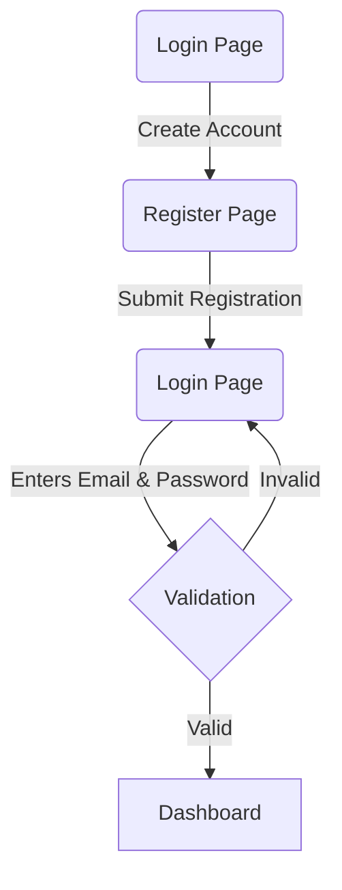
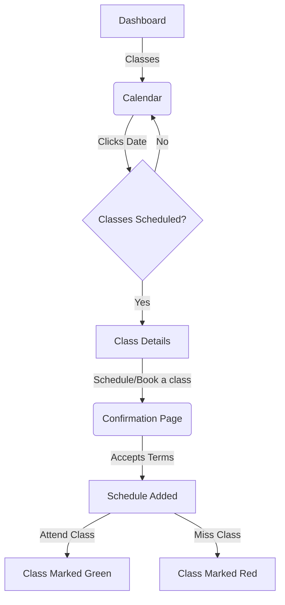
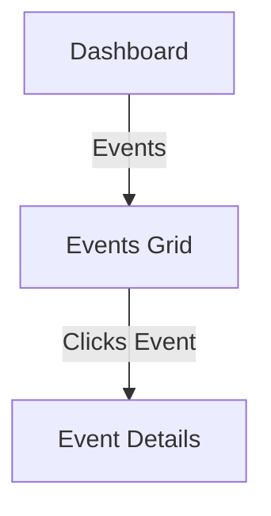
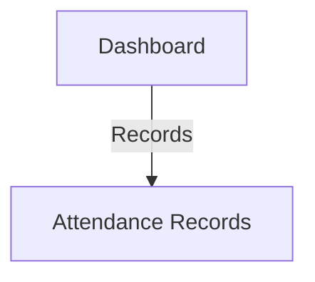

#### 1. New User Registration & Login

- **User Story:**

  - As a new user, I want to register for an account and log in to access the app's features.

- **Detailed Steps:**

  1. User opens the app and is directed to the login page.
  2. User clicks on the "Create account" link.
  3. User is redirected to the registration page where they enter their email, first name, last name, password, and select a box.
  4. User submits the registration form.
  5. Backend validates the user's information and creates a new account.
  6. User is redirected back to the login page.
  7. User enters their email and password.
  8. User submits the login form.
  9. Backend validates the user's credentials and generates a validation token.
  10. User is redirected to their dashboard where they can access the app's features.

- **Flow Diagram**

#### 2. Schedule Class

- **User Story:**

  - As a user, I want to schedule a class and view it on the calendar.

- **Detailed Steps:**

  1. User navigates to the "Classes" section in the left side panel of the dashboard.
  2. User views the calendar with available classes marked in grey text.
  3. User clicks on a date on the calendar.
  4. If classes are scheduled, a card displays the class details and a button to book the class.
  5. User clicks the "Schedule/Book a class" button.
  6. User accepts the terms on the confirmation page.
  7. Selected class is added to the user's schedule and marked by blue text on the calendar.
  8. When the user attends the class, it is marked green on the calendar; otherwise, it's marked red if missed.

- **Flow Diagram:**

#### 3. View Events

- **User Story:**

  - As a user, I want to view all available events and see their details.

- **Detailed Steps:**

  1. User navigates to the "Events" section in the left side panel of the dashboard.
  2. User sees a grid of cards listing all available events.
  3. User clicks on a card to reveal the event details.

- **Flow Diagram:**

#### 4. Access Records

- **User Story:**

  - As a user, I want to access my attendance records to see my enrolled, attended, and missed classes.

- **Detailed Steps:**

  1. User navigates to the "Records" section in the left side panel of the dashboard.
  2. User views the page displaying attendance records, including enrolled, attended, and missed classes.

- **Flow Diagram:**

